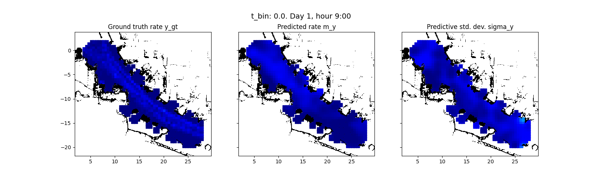

# CoPA-Map: Gaussian Process-based spatio-temporal modeling of pedestrians


CoPA-Map is a method to model spatio-temporal human activity with on Gaussian Processes.
A focus lies on the creation based on observations by mobile robots.




### Prerequisites
* Python 3.8

GPU-based training/inference was developed and tested with  tensorflow version 2.3.1 and CUDA 10.1.
See also setup.cfg for dependencies

### Installation

Install via ::

    python setup.py install

### Examples

#### General useage
```python
import copa_map.model.CoPAMapBase as copa_map
X = # numpy array of data with size (N, 3) (two spatial, one temporal location)
Y = # numpy array of rate with size (N, 1)
Z = # numpy array of initial inducing locations with size (M, 3)
X_test = # numpy array of grid-like test locations with size (N_t, 3)
# For an example of how to obtain these data vectors see TODO
model = copa_map.CoPAMapBase()
model.learn(X, Y, Z)
m_y, stdd_y = model.predict(X_test)

```
#### Example scripts
TODO
### Paper

    TODO
